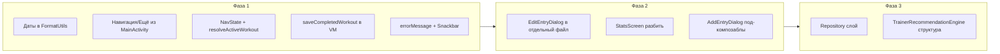

# Ревью проекта GymProgress: упрощение и читаемость

## Текущее состояние

- **Архитектура:** одна Activity, один [WorkoutViewModel](app/src/main/java/com/example/gymprogress/viewmodel/WorkoutViewModel.kt), навигация флагами в [MainActivity.kt](app/src/main/java/com/example/gymprogress/MainActivity.kt) (GymProgressApp), без слоя Repository — ViewModel обращается к DAO и SettingsRepository напрямую.
- **Главные точки роста сложности:**
  - [MainActivity.kt](app/src/main/java/com/example/gymprogress/MainActivity.kt) (~370 строк): 9 флагов навигации, 12 `collectAsState`, все экраны через `if (showX) { ... return }`, логика `saveCompletedSets` вынесена в конец файла.
  - [StatsScreen.kt](app/src/main/java/com/example/gymprogress/ui/screens/StatsScreen.kt) (~1370 строк): один файл, много приватных Composable (StatCard, HistoryRow, ScoreDetailDialog, ScoreFormulaHelpDialog, HelpHeader и др.).
  - [JournalScreen.kt](app/src/main/java/com/example/gymprogress/ui/screens/JournalScreen.kt) (~710 строк): внутри тот же файл — `EditEntryDialog` и дублирование форматов даты.
  - [AddEntryDialog.kt](app/src/main/java/com/example/gymprogress/ui/screens/AddEntryDialog.kt) (~~509 строк), [TrainerRecommendationEngine.kt](app/src/main/java/com/example/gymprogress/data/TrainerRecommendationEngine.kt) (~~587 строк) — крупные монолитные единицы.
- **Дублирование:** форматы даты `yyyy-MM-dd` и `dd.MM.yyyy` создаются в 6 местах (MainActivity, AddEntryDialog, JournalScreen x2, WorkoutHistoryScreen, TrainerRecommendationEngine). [FormatUtils](app/src/main/java/com/example/gymprogress/data/FormatUtils.kt) уже содержит `formatDate(storageDate)` для отображения, но парсинг и константы размазаны по экранам.
- **Обработка ошибок:** в ViewModel при ошибках БД только `Log.e`; состояния для Snackbar/Toast нет — пользователь не видит причину сбоя (в т.ч. при дубликате упражнения после UNIQUE в БД).

При этом бизнес-логика (Room, миграции, алгоритм прогресса, Тренер) уже на проде и трогать её контракты и схему БД не требуется. Ниже — только такие изменения, которые не меняют поведение приложения, а лишь упрощают код и подготовку к будущим доработкам.

---

## Даты и миграции: важное условие

**Разрешено:** менять или упрощать форматы дат и при необходимости делать дополнительную миграцию БД.

**Главная опасность:** не поломать существующие установки и не потерять данные. У пользователей, у которых уже есть история тренировок, она должна остаться корректной и не пропасть.

**Обязательно при любом изменении хранения дат:**

- Добавить миграцию Room (новая версия БД), в которой все существующие значения даты в `workout_entries` переносятся в новый формат без потерь.
- Поддерживать в миграции оба варианта: уже нормализованный `yyyy-MM-dd` (миграция 5→6) и, на всякий случай, старый `dd.MM.yyyy`, чтобы ни одна запись не оказалась битой или пустой.
- После миграции проверять на реальной БД (экспорт с устройства со старой версией): обновление приложения не должно удалять и не портить записи.

Дополнительная миграция для дат допустима; приоритет — сохранность данных у существующих пользователей.

---

## Рекомендуемые улучшения (по приоритету)

### Фаза 1: Низкий риск, быстрый выигрыш по читаемости

**1. Работа с датами (два варианта на выбор)**

**Вариант A — только централизация (без смены схемы):**

- В [FormatUtils.kt](app/src/main/java/com/example/gymprogress/data/FormatUtils.kt) добавить константы форматов (`STORAGE_DATE_PATTERN = "yyyy-MM-dd"`, `DISPLAY_DATE_PATTERN = "dd.MM.yyyy"`), а также `fun toStorageDate(localDate: LocalDate): String`, `fun parseStorageDate(date: String): LocalDate?`, оставив существующий `formatDate(storageDate: String)` для отображения.
- Заменить все прямые `DateTimeFormatter.ofPattern(...)` и дублирующий парсинг в MainActivity, AddEntryDialog, JournalScreen, WorkoutHistoryScreen, TrainerRecommendationEngine на вызовы FormatUtils.
- Схему БД не менять; данные остаются строками `yyyy-MM-dd`.

**Вариант B — переход на хранение даты в Long (epoch day или epoch millis) с миграцией:**

- Добавить миграцию 6→7: в `workout_entries` добавить колонку `dateEpochDay INTEGER` (или аналог), заполнить её из существующей `date`: парсить строку (поддержать и `yyyy-MM-dd`, и `dd.MM.yyyy` на случай старых данных), конвертировать в epoch day; для нечитаемых строк — не трогать запись или подставить безопасное значение и залогировать.
- В следующем шаге (или в той же миграции): перенести данные в новую колонку, удалить старую `date`, переименовать `dateEpochDay` в `date` (или оставить одно поле типа Long в сущности и в схеме). В [WorkoutEntry](app/src/main/java/com/example/gymprogress/data/WorkoutEntry.kt) заменить `date: String` на `dateEpochDay: Long` (или `date: Long`) и добавить TypeConverter для Room. DAO и все места кода перевести на Long / LocalDate через FormatUtils.
- Плюс: корректная сортировка и сравнение дат без зависимости от формата строки; один источник правды в коде (FormatUtils + конвертеры). Миграция должна гарантировать: ни одна существующая запись не теряется и не искажается.

В обоих вариантах итог: один источник правды для форматов и парсинга; при выборе B — более надёжное хранение и возможность упростить форматы в будущем.

**Рекомендация:** начать с варианта A (быстро, без риска для БД); при желании усилить — позже сделать вариант B с отдельной тщательно проверенной миграцией и тестом на копии продовой БД.

**2. Вынести навигацию и «Ещё» из MainActivity**

- В том же пакете (или `ui/navigation`) ввести один-два композабла:
  - **Вариант A:** `AppNavigationScaffold(...)` — принимает `currentDestination`, `onDestinationChange`, `onOpenTrainer`, `onOpenHistory`, `onOpenSettings`, `onOpenAbout`, и рендерит `NavigationSuiteScaffold` с табами + пункт «Ещё» с выпадающим меню (сейчас этот блок ~80 строк внутри MainActivity).
  - **Вариант B:** минимум — вынести только выпадающее меню «Ещё» в `MoreMenuContent(expanded, onDismiss, onTrainer, onHistory, onSettings, onAbout)` и оставить scaffold в MainActivity.
- В `GymProgressApp` оставить только: состояние навигации (можно объединить в один data-класс, см. ниже), вызовы нового scaffold/меню и `when (currentDestination)` с тремя экранами. Так убирается визуальный шум и дублирование паттерна «showMoreMenu = false; showX = true».

**3. Группировка состояния навигации в MainActivity**

- Ввести, например, `data class AppNavState(...)` с полями: `currentTab`, `showAddDialog`, `showSettings`, `showAbout`, `showTrainer`, `showTrainerSettings`, `showActiveWorkout`, `showWorkoutHistory`, `activeWorkoutRec`, или использовать отдельные `var` но держать их в одном блоке в начале с короткими комментариями (Tab / Modals / Overlays). Альтернатива — один `MutableStateFlow<AppNavState>` в композабле и обновления через `copy`. Цель — не размазывать 9 флагов по коду и упростить чтение.
- Опционально: вынести логику «если showActiveWorkout и нет activeWorkoutRec — подставить recommendation и т.д.» в одну маленькую функцию `resolveActiveWorkoutState(...)`, чтобы основной композабл не перегружался условиями.

**4. Перенос saveCompletedSets в ViewModel**

- Добавить в [WorkoutViewModel.kt](app/src/main/java/com/example/gymprogress/viewmodel/WorkoutViewModel.kt) метод, например, `fun saveCompletedWorkout(completedSets: List<CompletedSet>)`, и перенести туда всю логику из [MainActivity.kt](app/src/main/java/com/example/gymprogress/MainActivity.kt) (`saveCompletedSets`): определение «сегодня», фильтр WORKING, группировка по упражнению/весу, вызовы `addEntry`. Сигнатуру и поведение (как именно группируются подходы и создаются записи) не менять.
- В MainActivity оставить только вызов `viewModel.saveCompletedWorkout(completedSets)` и сброс `showActiveWorkout` / `activeWorkoutRec`. Так бизнес-логика «сохранения завершённой тренировки» живёт в одном месте и не размазана по UI.

**5. Обратная связь по ошибкам в ViewModel**

- Добавить в ViewModel, например, `val errorMessage: StateFlow<String?>` и `fun clearError()`. В `addEntry`, `updateEntry`, `deleteEntry`, `addExercise`, `updateExercise`, `deleteExercise`, `setTrainingGoal`, `setBodyWeightKg`, `updateTrainerSettings` в `catch` кроме `Log.e` выставлять `_errorMessage.value = e.message ?: "Ошибка"` (или короткое пользовательское сообщение).
- В `GymProgressApp` (или в корневом композабле) подписаться на `errorMessage`, показывать Snackbar при не-null и вызывать `clearError()` при dismiss. Это не меняет существующие вызовы из UI, только добавляет наблюдаемое состояние и один блок отображения ошибки — поведение «приложение не падает» сохраняется, но пользователь видит причину сбоя.

---

### Фаза 2: Разбиение крупных экранов (без смены поведения)

**6. Вынести EditEntryDialog из JournalScreen**

- Перенести [EditEntryDialog](app/src/main/java/com/example/gymprogress/ui/screens/JournalScreen.kt) (и вспомогательные `parseEntryDate` / `parseEntryDateOrNull`, если не переедут в FormatUtils) в отдельный файл, например `EditEntryDialog.kt` в том же пакете `ui.screens`. В JournalScreen оставить только вызов этого композабла. Подписи и контракт не менять.

**7. Разбить StatsScreen на несколько файлов**

- Вынести в отдельные файлы (в том же пакете или `ui/screens/stats/`):
  - компоненты помощи: `ScoreFormulaHelpDialog`, `HelpHeader`, `HelpFormula`, `HelpExample`, `HelpNote`, `HelpChip`, `HelpRow`, `HelpGoalRow` — в один файл, например `StatsHelp.kt`;
  - при необходимости — карточки и строки (StatCard, HistoryRow, ScoreDetailDialog, WorkoutDaySection и т.д.) в `StatsComponents.kt`.
- [StatsScreen.kt](app/src/main/java/com/example/gymprogress/ui/screens/StatsScreen.kt) оставить как точку входа с основным Scaffold и списками, подключая вынесенные composable. Публичный API `StatsScreen(...)` не менять.

**8. Опционально: разбить AddEntryDialog на под-композаблы**

- Внутри [AddEntryDialog.kt](app/src/main/java/com/example/gymprogress/ui/screens/AddEntryDialog.kt) выделить, например, `AddEntryExercisePicker`, `AddEntrySetRows`, `AddEntryDateRow` и т.п., не меняя внешний контракт `AddEntryDialog(..., onConfirm)`. Это уменьшит размер одного composable и упростит чтение.

---

### Фаза 3: Опциональные архитектурные шаги (если нужна ещё большая ясность)

**9. Слой Repository (опционально)**

- Ввести, например, `WorkoutRepository` (обёртка над WorkoutDao) и `ExerciseRepository` (над ExerciseDao): все вызовы `workoutDao.`* / `exerciseDao.`* из ViewModel идут через репозитории. Сигнатуры публичного API ViewModel не менять — только перенаправление вызовов. Это улучшит тестируемость и явно разделит «источник данных» и «логика экрана», без смены бизнес-логики.

**10. TrainerRecommendationEngine (опционально)**

- Оставить один класс; при желании разбить на несколько внутренних `object` или extension-файлов по зонам ответственности (например, выбор дня, делоад, построение списка упражнений), не меняя публичный `generateRecommendation` и `getAlternatives`. Либо просто добавить секционные комментарии в начале приватных методов для навигации по файлу.

---

## Что не менять (чтобы не сломать прод)

- Схему и миграции Room менять можно только с новой миграцией; при изменении хранения дат — миграция обязана сохранять все существующие записи (см. раздел «Даты и миграции» выше).
- Публичные контракты экранов (параметры `JournalScreen`, `StatsScreen`, `AddEntryDialog` и т.д.) — можно добавлять необязательные параметры, не ломая существующие вызовы.
- Алгоритмы в [WorkoutScoreCalculator](app/src/main/java/com/example/gymprogress/data/WorkoutScoreCalculator.kt) и [TrainerRecommendationEngine](app/src/main/java/com/example/gymprogress/data/TrainerRecommendationEngine.kt) (формулы, коэффициенты, целевые диапазоны).
- Логику определения «сегодня» и способ сохранения завершённых подходов (только перенос из MainActivity в ViewModel без изменения правил группировки).

---

## Порядок внедрения

- Сначала выполнить фазу 1 (п. 1–5): централизация дат, вынос навигации/меню, группировка NavState, перенос saveCompletedWorkout, ошибки в UI. После каждого шага — прогон сценариев (журнал, добавление/редактирование записи, тренер, активная тренировка, настройки).
- Затем фазу 2 (п. 6–8): разбиение экранов и диалогов без изменения контрактов.
- Фазу 3 делать по желанию для дальнейшего упрощения поддержки и тестов.

---

## Краткий итог

| Проблема                                   | Решение                                                                 | Риск                                 |
| ------------------------------------------ | ----------------------------------------------------------------------- | ------------------------------------ |
| Дублирование форматов дат в 6 местах       | Централизация в FormatUtils (или миграция на Long с сохранением данных) | Низкий при миграции с проверкой      |
| MainActivity перегружен флагами и меню     | NavState + вынос scaffold/меню                                          | Низкий                               |
| Логика saveCompletedSets в UI              | Перенос в ViewModel.saveCompletedWorkout                                | Низкий                               |
| Нет отображения ошибок БД пользователю     | errorMessage + Snackbar                                                 | Низкий                               |
| StatsScreen 1370 строк                     | Вынести Help и компоненты в отдельные файлы                             | Низкий                               |
| JournalScreen 710 + EditEntryDialog внутри | Вынести EditEntryDialog в свой файл                                     | Низкий                               |
| Один огромный ViewModel без репозиториев   | Опционально Repository                                                  | Средний (только рефакторинг вызовов) |

Бизнес-логику и контракты с продом не меняем; улучшаем только структуру, читаемость и обратную связь по ошибкам. Изменение формата или способа хранения дат допускается при условии миграции, которая гарантирует сохранность истории тренировок у существующих пользователей.