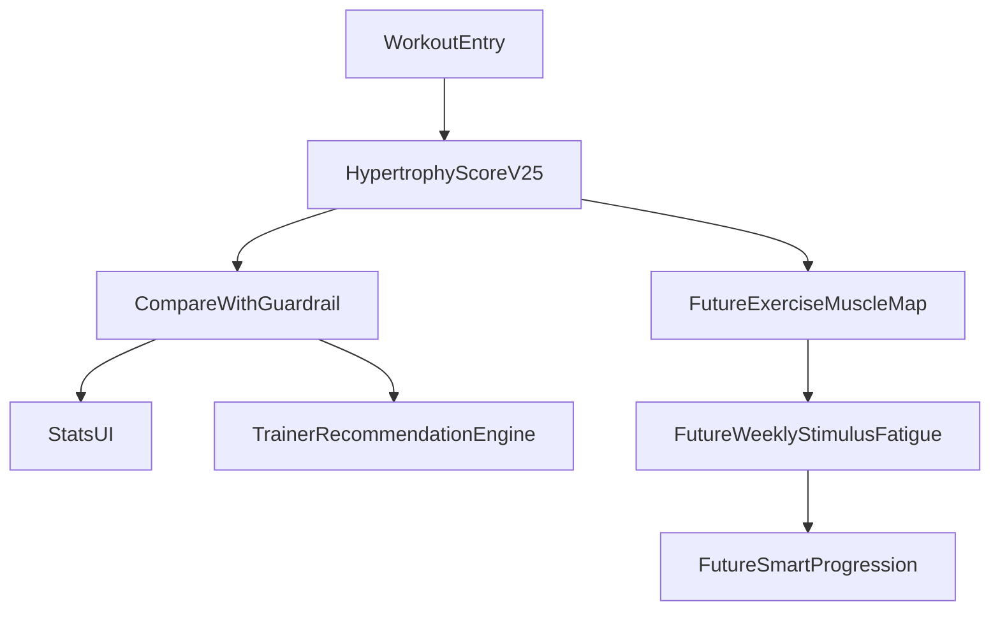

# Hypertrophy Scoring V2.5 Plan

## Цель

Внедрить новую модель скоринга гипертрофии в проект GymProgress так, чтобы она корректно оценивала тяжёлую работу в продуктивном диапазоне повторений и больше не занижала результат только из-за меньшего тоннажа. В первой фазе реализуются только: `1)` новый hypertrophy scoring v2.5, `2)` guardrail-правила сравнения. Пункты `3–5` описываются как следующая архитектурная фаза, но без выполнения сейчас.

## Что меняем в первой фазе

- Переписываем ветку `TrainingGoal.HYPERTROPHY` в [C:/projects/GymProgress/app/src/main/java/com/example/gymprogress/data/WorkoutScoreCalculator.kt](C:/projects/GymProgress/app/src/main/java/com/example/gymprogress/data/WorkoutScoreCalculator.kt).
- Сохраняем текущую общую архитектуру `calcSessionScore()` и `compare()`, чтобы не ломать UI и тренерский движок.
- Для `STRENGTH` и `ENDURANCE` временно оставляем текущую логику без функциональных изменений.
- Добавляем explainable-компоненты скоринга для гипертрофии: `tension`, `productiveScore`, `repQuality`, `fatiguePenalty`, `guardrailApplied`.

## Текущая база, на которую опираемся

- Скоринг централизован в [C:/projects/GymProgress/app/src/main/java/com/example/gymprogress/data/WorkoutScoreCalculator.kt](C:/projects/GymProgress/app/src/main/java/com/example/gymprogress/data/WorkoutScoreCalculator.kt).
- Тип упражнения уже есть в [C:/projects/GymProgress/app/src/main/java/com/example/gymprogress/data/Exercise.kt](C:/projects/GymProgress/app/src/main/java/com/example/gymprogress/data/Exercise.kt) через поле `exerciseType`.
- Цели тренировок уже определены в [C:/projects/GymProgress/app/src/main/java/com/example/gymprogress/data/TrainingGoal.kt](C:/projects/GymProgress/app/src/main/java/com/example/gymprogress/data/TrainingGoal.kt).
- Скоринг используется в:
  - [C:/projects/GymProgress/app/src/main/java/com/example/gymprogress/ui/screens/StatsScreen.kt](C:/projects/GymProgress/app/src/main/java/com/example/gymprogress/ui/screens/StatsScreen.kt)
  - [C:/projects/GymProgress/app/src/main/java/com/example/gymprogress/ui/screens/StatsComponents.kt](C:/projects/GymProgress/app/src/main/java/com/example/gymprogress/ui/screens/StatsComponents.kt)
  - [C:/projects/GymProgress/app/src/main/java/com/example/gymprogress/ui/screens/AddEntryDialog.kt](C:/projects/GymProgress/app/src/main/java/com/example/gymprogress/ui/screens/AddEntryDialog.kt)
  - [C:/projects/GymProgress/app/src/main/java/com/example/gymprogress/data/TrainerRecommendationEngine.kt](C:/projects/GymProgress/app/src/main/java/com/example/gymprogress/data/TrainerRecommendationEngine.kt)

## Алгоритм v2.5 для реализации

### Productive zone коэффициенты

Для гипертрофии рассчитываем коэффициент каждого подхода в зависимости от `ExerciseType`.

`COMPOUND`:

- `5..10 -> 1.00`
- `11..15 -> 0.95`
- `3..4 -> 0.75`
- `16..20 -> 0.80`
- иначе `0.50`

`ISOLATION`:

- `8..15 -> 1.00`
- `6..7 -> 0.90`
- `16..20 -> 0.95`
- `21..30 -> 0.75`
- иначе `0.50`

### Новые вычисления для гипертрофии

- `setStimulusUnits = reps * zoneCoefficient`
- `totalStimulusUnits = sum(setStimulusUnits)`
- `tensionScore = currentWeight / bestWeightHistory`
- `productiveScore = sqrt(currentStimulusUnits / bestStimulusUnits)`
- `repQuality = average(zoneCoefficient per set)`
- `fatiguePenalty` пока оставляем текущий мягкий по rep drop

### Итоговый score

`COMPOUND`:

- `0.55 * tensionScore + 0.25 * productiveScore + 0.20 * repQuality - fatiguePenalty`

`ISOLATION`:

- `0.30 * tensionScore + 0.45 * productiveScore + 0.25 * repQuality - fatiguePenalty`

### Нормализация

- Внутренне можно сохранить текущий user-facing диапазон `0..1000`, чтобы минимизировать UI-изменения.
- Рекомендуемая схема: сначала считаем `rawScoreNormalized` как `0.0..1.2`, затем переводим в `Int`-балл. Для обратной совместимости нужно аккуратно выбрать коэффициент масштабирования и обновить текст в help/labels, если он сейчас жёстко привязан к идее `100 = рекорд`.
- В плане реализации отдельно проверить, не завязаны ли тексты и условия UI/Trainer на предположение о шкале `100 = PR`.

## Guardrail-логика для первой фазы

Добавляем post-processing поверх базового сравнения в `compare()`.

### Guardrail Rule A

Если для `TrainingGoal.HYPERTROPHY` и `ExerciseType.COMPOUND` выполнено всё:

- текущий вес >= предыдущего веса * `1.05`
- все текущие подходы находятся в productive zone
- суммарные повторы снизились не более чем на `30%`
- `fatiguePenalty` не стал существенно хуже, например рост не более `0.03`

тогда статус сравнения не может быть `WORSE`.

### Guardrail Rule B

Если вес вырос, но:

- подходы ушли вне productive zone,
- или повторы упали более чем на `35–40%`,
- или penalty заметно вырос,

тогда разрешаем `SAME` или `WORSE` по основной формуле.

### Guardrail Rule C

Для очень тяжёлой низкоповторной работы (`1..3 reps`) не даём ложный hypertrophy win, даже если вес вырос.

### Explainability

В `ComparisonResult.reason` и/или detail-дополнении фиксировать, что guardrail был применён, чтобы поведение алгоритма было объяснимым пользователю и разработчику.

## Изменения по файлам в первой фазе

### [C:/projects/GymProgress/app/src/main/java/com/example/gymprogress/data/WorkoutScoreCalculator.kt](C:/projects/GymProgress/app/src/main/java/com/example/gymprogress/data/WorkoutScoreCalculator.kt)

Основной файл первой фазы.

Планируемые изменения:

- Добавить внутренние helper-функции:
  - `getHypertrophyZoneCoefficient(reps, exerciseType)`
  - `calcHypertrophyStimulusUnits(repsList, exerciseType)`
  - `calcHypertrophyTensionScore(entry, history)`
  - `calcHypertrophyProductiveScore(entry, history, exerciseType)`
  - `calcHypertrophyRepQuality(repsList, exerciseType)`
  - `applyHypertrophyGuardrail(...)`
- Разделить текущую логику `calcSessionScore()` по целям: отдельная ветка для hypertrophy v2.5, остальные ветки оставить максимально близкими к текущим.
- Расширить `ScoreComponents`, чтобы хранить новые meaningful-компоненты для гипертрофии. Если не хочется ломать UI, можно добавить nullable-поля или новое detail-представление.
- Пересмотреть `reason` в `compare()` так, чтобы основная причина могла быть одной из:
  - `Напряжение ↑`
  - `Продуктивные повторы ↑`
  - `Качество диапазона ↑`
  - `Усталость ↑`
  - `Сработала защита для тяжёлой работы в продуктивной зоне`
- Не менять порядок истории и не ломать существующие assumptions из `AGENTS.md` про сортировку записей.

### [C:/projects/GymProgress/app/src/main/java/com/example/gymprogress/data/TrainerRecommendationEngine.kt](C:/projects/GymProgress/app/src/main/java/com/example/gymprogress/data/TrainerRecommendationEngine.kt)

Функционально крупно не переписывать, но проверить влияние новой шкалы.

Проверить места:

- `isLowFatigue`
- `isHighFatigue`
- `isImproving`
- `isStagnating`
- рекомендации по рабочим подходам и progression

Задача первой фазы здесь:

- адаптировать пороги, если новый скоринг меняет характер распределения `score`
- не внедрять новую progression-логику, только стабилизировать существующую

### [C:/projects/GymProgress/app/src/main/java/com/example/gymprogress/ui/screens/StatsScreen.kt](C:/projects/GymProgress/app/src/main/java/com/example/gymprogress/ui/screens/StatsScreen.kt)

Проверить, не предполагает ли экран старую семантику score (`100 = рекорд`). При необходимости скорректировать отображение только текстово.

### [C:/projects/GymProgress/app/src/main/java/com/example/gymprogress/ui/screens/StatsComponents.kt](C:/projects/GymProgress/app/src/main/java/com/example/gymprogress/ui/screens/StatsComponents.kt)

Проверить отображение breakdown-компонентов. Возможно, заменить labels под новые значения:

- вместо старой единственной метрики показывать tension/productive zone/quality/fatigue
- если это слишком большой UI-объём для первой фазы, оставить UI почти как есть, но не показывать misleading labels

### [C:/projects/GymProgress/app/src/main/java/com/example/gymprogress/ui/screens/AddEntryDialog.kt](C:/projects/GymProgress/app/src/main/java/com/example/gymprogress/ui/screens/AddEntryDialog.kt)

Проверить preview score после ввода новой записи, чтобы там не было регрессии и чтобы кейсы типа `60x10-12 -> 70x8-9` отображались логичнее.

### [C:/projects/GymProgress/app/src/main/java/com/example/gymprogress/ui/screens/StatsHelp.kt](C:/projects/GymProgress/app/src/main/java/com/example/gymprogress/ui/screens/StatsHelp.kt)

Обновить help-текст после внедрения, чтобы описывать новую логику человеческим языком: вес, продуктивный диапазон, качество подходов, мягкий штраф усталости, защита от несправедливого минуса за меньший тоннаж.

## Тестовый набор для первой фазы

Нужно не просто “запустить”, а проверить руками и, по возможности, unit-тестами следующие кейсы:

### Критичные позитивные кейсы

- `compound hypertrophy`: `60 x 10,12,11,12` -> `70 x 8,8,8,9` должно быть `SAME` или `BETTER`, но не `WORSE`
- одинаковый вес, +1–2 повтора в productive zone -> `BETTER`
- вес выше, но повторения ещё в productive zone -> чаще `BETTER`
- изоляция `12,12,12` -> `14,13,12` на том же весе -> `BETTER`

### Критичные негативные кейсы

- вес выше, но `3,3,2` при goal hypertrophy -> не считать явным hypertrophy win
- вес выше, но огромный обвал объёма и высокая просадка -> `SAME` или `WORSE`
- повторы вышли далеко за productive zone -> score падает

### Регрессии

- `STRENGTH` не ломается
- `ENDURANCE` не ломается
- `TrainerRecommendationEngine` продолжает выдавать советы без нелепых скачков
- breakdown и reason не содержат противоречивых подписей

## Порядок реализации первой фазы

1. Подготовить новые internal helper-функции в `WorkoutScoreCalculator`.
2. Внедрить hypertrophy v2.5 scoring без UI-изменений.
3. Подключить guardrail в `compare()`.
4. Адаптировать reason/details.
5. Проверить все места потребления score в UI и trainer engine.
6. Обновить help-текст.
7. Прогнать ручные сценарии на исторических примерах.
8. При наличии тестовой инфраструктуры добавить unit-тесты для ключевых кейсов scoring/guardrail.

## Риски первой фазы

- Сломать существующие эвристики тренера, если пороги слишком завязаны на старую шкалу.
- Оставить misleading UI, если семантика компонентов уже поменяется, а подписи нет.
- Слишком агрессивный guardrail может начать скрывать реальные ухудшения.
- Слишком мягкий productiveScore может переоценивать малый объём на высоком весе.

## Как оценивать успех первой фазы

- кейс тяжёлого прогресса в рабочем диапазоне больше не уходит в ложный минус
- `reason` объясним пользователю
- score визуально стабилен между близкими тренировками
- trainer recommendations не деградируют

## Пункты 3–5: подробно описать, но не реализовывать сейчас

### 3. Exercise -> Muscles Map

Цель: перейти от “упражнение относится к одной группе” к “упражнение распределяет stimulus по нескольким мышцам с весами”.

Потребуется:

- новая каноническая сущность упражнения или справочник map-профилей
- веса вклада по мышцам, например `bench -> chest 1.0, triceps 0.55, frontDelts 0.35`
- слой сопоставления пользовательских упражнений с каноническими

Ключевые файлы следующей фазы:

- [C:/projects/GymProgress/app/src/main/java/com/example/gymprogress/data/Exercise.kt](C:/projects/GymProgress/app/src/main/java/com/example/gymprogress/data/Exercise.kt)
- DAO/DB-модели рядом с `AppDatabase`
- trainer engine и stats, где сейчас используется один `muscleGroup`

Отдельная задача миграции:

- нормализация имён существующих упражнений
- exact match / alias match / fuzzy match
- `matchConfidence`
- safe fallback на старый `muscleGroup`
- ручное подтверждение пользователя для сомнительных совпадений

### 4. Weekly Stimulus / Fatigue Accumulation

Цель: считать недельную нагрузку по каждой мышце, а не только по упражнению.

Концепция:

- `exerciseSessionStimulus -> muscleStimulus via contribution factors`
- агрегирование по окну 7 дней или по тренировочной неделе
- отдельные метрики `weeklyStimulus`, `weeklyFatigue`, `recoveryPressure`
- use cases: предупреждать о недогрузе, перегрузе, рекомендовать deload/смену акцента

Важно:

- это должен быть следующий слой поверх exercise scoring, а не замена session score
- weekly metrics не должны напрямую ломать текущий compare per exercise

### 5. Smarter Progression Logic

Цель: сделать progression зависящей не только от rep range, но и от quality/fatigue/stimulus trend.

Будущая логика может учитывать:

- последние 2–3 session scores упражнения
- стабильность внутри productive zone
- накопленную локальную fatigue по целевым мышцам
- текущую фазу: push / hold / deload

Потенциальные решения:

- `increase weight`
- `keep weight, add reps`
- `keep weight, reduce sets`
- `deload this exercise`
- `swap exercise variation`

Ограничение: не внедрять, пока не стабилизирован v2.5 scoring и не появится muscle mapping.

## Mermaid overview

## Готовность к старту

Первая реализация должна ограничиться изменениями scoring/compare/help и мягкой адаптацией trainer thresholds, без миграции БД и без изменения схемы Room.